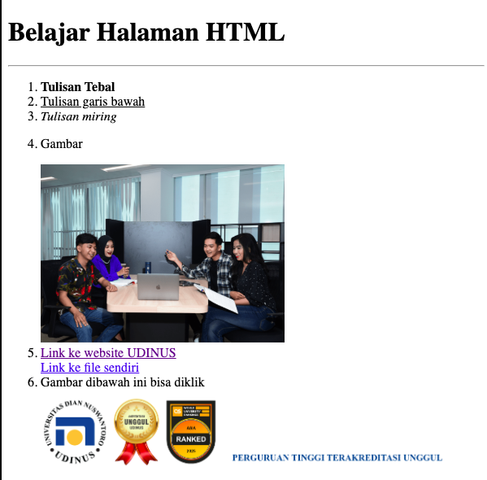
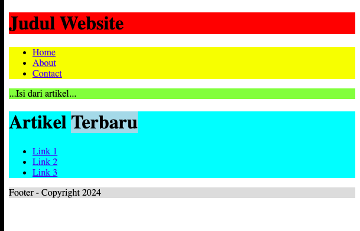
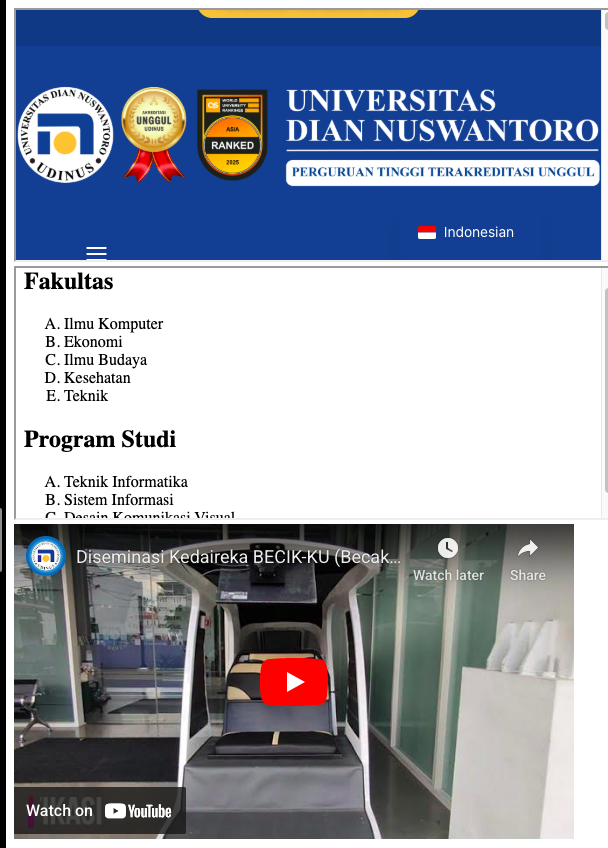

# Tugas Pertemuan 2
# Bimo Dwi Laksono
# A18.2025.00201

## Latihan 1

```html
<!DOCTYPE html>
<html lang="en">
<head>
  <meta charset="UTF-8">
  <meta name="viewport" content="width=device-width, initial-scale=1.0">
  <title>Tugas Pertemuan 2 - Latihan 1</title>
</head>
<body>
  <h1>Belajar Halaman HTML</h1>
  <hr />
  <ol>
    <li><b>Tulisan Tebal</b></li>
    <li><u>Tulisan garis bawah</u></li>
    <li><i>Tulisan miring</i></li>
    <li>
        <p>Gambar</p>
        
    </li>

      <li>
          <a href="https://dinus.ac.id" target="_blank">Link ke website UDINUS</a><br>
          <a href="nama_file.pdf">Link ke file sendiri</a>
      </li>

      <li>Gambar dibawah ini bisa diklik<br>
          <a href="https://dinus.ac.id" target="_blank">
              
          </a>
      </li>
  </ol>
</body>
</html>
```


## Latihan 2

```html
<!DOCTYPE html>
<html lang="en">
<head>
  <meta charset="UTF-8">
  <meta name="viewport" content="width=device-width, initial-scale=1.0">
  <title>Tugas Pertemuan 2 - Latihan 2</title>
</head>
<body>
  <div style="background-color: red;">
    <h1>Judul Website</h1>
  </div>

  <div style="background-color: yellow;">
    <ul>
      <li>
        <a href="#">Home</a>
      </li>
      <li>
        <a href="#">About</a>
      </li>
      <li>
        <a href="#">Contact</a>
      </li>
    </ul>
  </div>

  <div style="background-color: greenyellow;">
    <p>...Isi dari artikel...</p>
  </div>

  <div style="background-color: cyan;">
    <h1>Artikel <span style="background-color: lightblue;">Terbaru</span></h1>

    <ul>
      <li><a href="#">Link 1</a></li>
      <li><a href="#">Link 2</a></li>
      <li><a href="#">Link 3</a></li>
    </ul>
  </div>

  <div style="background-color: gainsboro;">
    <p>Footer - Copyright 2024</p>
  </div>
</body>
</html>
```



## Latihan 3

```html
<!DOCTYPE html>
<html lang="en">
<head>
  <meta charset="UTF-8">
  <meta name="viewport" content="width=device-width, initial-scale=1.0">
  <title>TP 2 - Latihan 3</title>
</head>
<body>
  <iframe src="https://dinus.ac.id" width="600" height="250"></iframe>
  <iframe src="list.html" width="600" height="250"></iframe>

  <iframe 
    width="560" 
    height="315" 
    src="https://www.youtube.com/embed/TyGkpW_MhaI?si=_seZnpQJpyXI5cLM" 
    title="YouTube video player" 
    frameborder="0" 
    allow="accelerometer; autoplay; clipboard-write; encrypted-media; gyroscope; picture-in-picture; web-share" referrerpolicy="strict-origin-when-cross-origin" 
    allowfullscreen></iframe>
</body>
</html>
```
